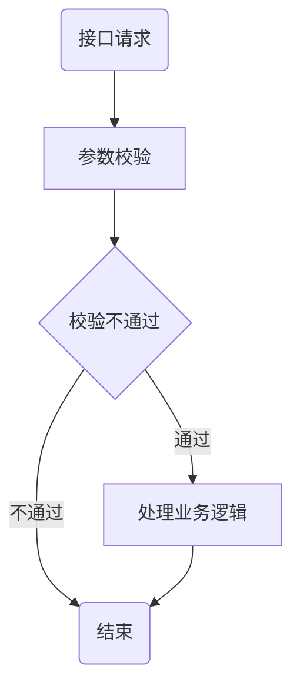

# ***算法学习***

[左程云](#1-左程云)|[刷题]( #2-刷题 )

```
从算法小白开始学习
```
***
##  ***1 左程云***
*哔哩哔哩视频地址 :*  <https://www.bilibili.com/video/BV13g41157hK/?p=3&spm_id_from=pageDriver&vd_source=6ef06f7d27a2f048b7cb5660c236c657>

### 1.1 基础
- [认识复杂度和简单排序算法]()

   ***加粗斜体***
   
+ [认识O(NlogN)的排序]()
### 1.2 基础提升
* [认识复杂度和简单排序算法]()
+ [认识O(NlogN)的排序]()
### 1.3 中级
- [认识复杂度和简单排序算法]()
+ [认识O(NlogN)的排序]()
### 1.4 高级
- [认识复杂度和简单排序算法]()
+ [认识O(NlogN)的排序]()

***
##  ***2 刷题***
1. 第一题

```c++
    const int i=0;
```

2. 第二题




